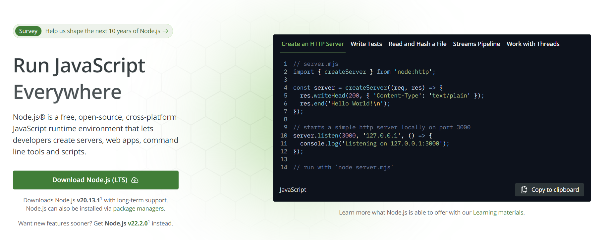

# node.js
 - JavaScript는 원래 브라우저에서 실행되던 언어
 - JavaScript 구동 엔진인 v8기반을 가져와서 서버 어플리케이션을 개발할 수 있도록 만든 것
 - JS로 백엔드 서버를 개발할 수 있게 되었다.
 - 장점:
   - 비동기(non-blocking): 개별 요청에 대한 처리를 비동기적으로 처리한다. (대량의 동시 연결을 효율적으로 처리)
   - Node Package Manager(npm)을 통해 다양한 오픈 소스 라이브러리와 도구를 손쉽게 사용할 수 있다.
   - 그나마 만만한 JavaScript언어를 이용해 쉽게 서버를 구성할 수 있다.
 - 단점:
   - CPU자원을 많이 소모하는 작업(이미지,동영상 처리, 프로세싱 서버 등)에 성능이 떨어짐 (Node.js자체는 싱글 스레드로 동작한다.)
   - JavaScript의 동적 특성, npm의존성 문제 등으로 보안 이슈가 생길 수 있다.

 - node.js 공식 페이지: https://nodejs.org

    

# node.js 설치 및 세팅 (Windows)
  - 사이트: https://nodejs.org/
  - LTS 버전을 다운로드 후 설치한다.
  - 에디터는 [VSCode](https://code.visualstudio.com/) 사용

### 기본 서버 구동해보기

 - server.js 파일에 다음 JavaScript코드를 작성해본다.
```js
import { createServer } from 'node:http';

const server = createServer((req, res) => {
  res.writeHead(200, { 'Content-Type': 'text/plain' });
  res.end('Hello World!\n');
});

// starts a simple http server locally on port 3000
server.listen(3000, '127.0.0.1', () => {
  console.log('Listening on 127.0.0.1:3000');
});
```
 - 터미널(명령프롬포트)에서 다음 명령어로 실행
```
node server.mjs
```

 - 브라우저에서 http://127.0.0.1:3000 으로 접속하여본다.

---

# express 프레임워크로 서버 프로젝트 생성
 - node.js로 서버 개발 시 [express 프레임워크](https://expressjs.com/)에서 제공하는 라우팅 API등을 활용하면 편리하게 개발할 수 있다.
 - express 프로젝트 생성 참고: https://expressjs.com/ko/starter/installing.html

### 프로젝트 생성하기
 - server.js 파일 생성

```js
const express = require('express');
const app = express();
const port = 3000;

app.listen(port, () => {
    console.log(`서버 실행중: http://localhost:${port}`);
});

app.get('/', (req, res) => {
    res.send('Hello World!');
});
```

 - 다음 명령을 터미널에 입력하여 node.js 프로젝트를 생성하고 express를 설치한다.

```bash
npm init -y
npm install express
# 또는 npm i express
```

### 서버 실행

```
npm server.js
```
 - 위 명령어를 터미널에서 실행 후 http://localhost:3000 접속
 - 서버를 종료할 때는 터미널에서 Ctrl+C를 눌러 종료한다.
 - 서버 코드가 수정되면 서버를 종료 후 재시작 하여야 수정 사항이 반영된다.
 - 종료-재시작이 귀찮다면 [nodemon 모듈](https://www.npmjs.com/package/nodemon)을 활용할 수 있다.
 - nodemon은 node monitor의 약자로, node가 실행하는 파일이 속한 디렉터리를 감시하고 있다가 파일이 수정될 경우 자동으로 서버를 재실행시켜준다.

설치 

```
npm i -g nodemon
```

실행 
```
nodemon server.js
```

 - `nodemon: 이 시스템에서 스크립트를 실행할 수 없으므로...` 에러 조치

```bash
# 관리자 권한으로 PoserShell실행 후 다음 명령어 입력
Set-ExecutionPolicy RemoteSigned

# 확인
Get-ExecutionPolicy
```


### 라우팅 (여러 페이지 처리)
 - 참고: https://expressjs.com/ko/starter/basic-routing.html
 - /news로 접속 시 뉴스 페이지를 보여주자

```js
// 메인 페이지 (/)
app.get('/', (req, res) => {
    res.send('Hello World!');
});

// news 페이지 접속 시
app.get('/news', (req, res) => {
    res.send('news~');
});
```

### 정적 파일 서비스

#### html 파일 응답하기
 
```js
res.sendFile(__dirname + '/index.html');
```

#### 정적 파일 디렉터리 등록 (image, css 등)
 - 참고: https://expressjs.com/ko/starter/static-files.html

```js
const app = express();
// ...
app.use(express.static(__dirname + '/public')) // public은 서버에 있는 폴더 예시
```

---

# 템플릿 엔진 사용하기
 - 서버에서 HTML파일을 동적으로 생성하기 위해 (순수하게 문자열을 조합하여 HTML을 만들어 보내줄 수 있지만 깔끔한 코드와 효율성을 위해...) 템플릿 엔진을 사용한다.
 - 참고: https://expressjs.com/ko/guide/using-template-engines.html
 - expressjs.com 예시는 pug가 사용되었으나, 본 강의에서는 [EJS를 사용하기로 한다.](https://ejs.co/)

### EJS 설치하기
 - 이곳을 참고한다: https://ejs.co/#install

```
npm install ejs
```

### EJS 사용 예시
 
 - 간단한 배열 데이터를 HTML화면으로 랜더링해보자.
 - `app.set('view engine', 'ejs');`를 통해 랜더링 엔진을 지정한다.
 - server.js

```js
const express = require('express');
const app = express();
const port = 3000;

const fruits = ['Apple', 'Banana', 'Orange', 'Mango']; // 배열 데이터

// EJS를 사용하기 위한 설정
app.set('view engine', 'ejs');

app.get('/', (req, res) => {
  // index.ejs 템플릿을 렌더링하고 배열 데이터를 전달
  res.render('index', { fruits: fruits });
});

app.listen(port, () => {
  console.log(`서버 실행중: http://localhost:${port}`);
});
```

 - views 폴더를 만들고 index.ejs파일 생성
 - views/index.ejs

```html
<!DOCTYPE html>
<html lang="en">
<head>
  <meta charset="UTF-8">
  <meta name="viewport" content="width=device-width, initial-scale=1.0">
  <title>Fruits List</title>
</head>
<body>
  <h1>Fruits List</h1>
  <ul>
    <% fruits.forEach(function(fruit) { %>
      <li><%= fruit %></li>
    <% }); %>
  </ul>
</body>
</html>
```

---

# 요청 데이터 처리

## GET 요청

#### URL 파라미터 (Path Varialbe)

```js
// 경로 파라미터 설정 (예: /users/:id)
app.get('/users/:id', (req, res) => {
    const userId = req.params.id;  // req.params 객체에서 파라미터 값 가져오기
    res.send(`User ID is: ${userId}`);
});
```

#### 쿼리 파라미터 처리

```js
// 예: /search?keyword=nodejs 요청
app.get('/search', (req, res) => {
    const keyword = req.query.keyword;  // req.query 객체에서 쿼리 파라미터 값 가져오기
    res.send(`Search keyword is: ${keyword}`);
});
```

## POST 요청

### HTML Form 요청 처리

 - 다음과 같이 html폼이 있을 때 서버에서 submit 처리를 해보자

```html
<!DOCTYPE html>
<html>
<head>
    <title>POST 요청 테스트</title>
</head>
<body>
    <form action="/submit" method="post">
        <label for="name">이름:</label>
        <input type="text" id="name" name="name"><br>
        <label for="age">나이:</label>
        <input type="text" id="age" name="age"><br>
        <input type="submit" value="제출">
    </form>
</body>
</html>
```

```js
app.use(express.urlencoded({ extended: true }));

// HTML 파일 서비스
app.get('/', (req, res) => {
    res.sendFile(__dirname + '/form.html');
});

// POST 요청 처리
app.post('/submit', (req, res) => {
    const name = req.body.name;  // req.body에서 데이터 추출
    const age = req.body.age;
    res.send(`Name is: ${name}, Age is: ${age}`);
});

```

