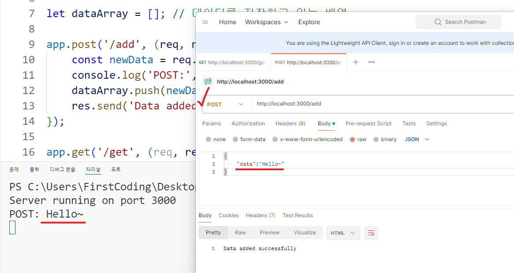
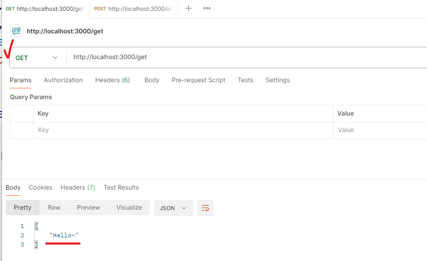
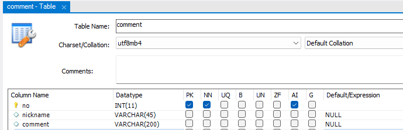
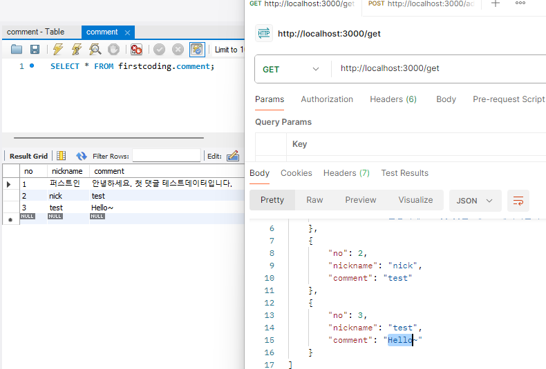

# 웹 서버에서 데이터 저장 및 조회
 - HTTP 서버를 활용하여 데이터를 주고 받을 때 다음 Method가 사용된다. (CRUD 동작)
   - 등록(생성: Create): POST
   - 조회(읽기: Read): GET
   - 수정(갱신: Update): PUT, PATCH
   - 삭제(삭제: Delete): DELETE
 - 데이터 관점에서의 CRUD 동작을 주로 REST API로 구현하여 통신하며 웹 서비스 개발 영역에서는 이룰 주로 API라고 부른다.
   - [REST API 참고](https://github.com/ttaengz/spring-study/blob/main/docs/05%20RESTful%20API.md)
   - HTTP 프로토콜 자제 스펙은 Stateless (무상태: 각 호출 간 상태를 가지지 않는다.)가 기본이지만 DB등의 외부 기술을 사용하여 상태를 저장한다.
   - 예: 게시판(글-등록조회수정삭제), 쇼핑몰(상품-등록조회수정삭제)(주문-등록조회수정삭제), SNS(게시판과 비슷)

## Node.js 간단한 저장과 조회
 - 아래 코드는 POST로 요청되는 데이터를 배열에 저장하는 예시이다. 
 - **(주의: 서버 코드 변수에 데이터 저장은 권장되는 방법은 아님)**
 - HTTP Body에 `{"data":"어쩌고데이터"}`와 같이 JSON데이터를 `/add`주소로 POST요청 시 서버는 `"data"`필드의 값을 dataArray배열에 추가한다.

```js
const express = require('express');
const app = express();
const port = 3000;

app.use(express.json());

let dataArray = []; // 데이터를 저장하고 있는 배열

app.post('/add', (req, res) => {
    const newData = req.body.data;
    console.log('POST:', newData);
    dataArray.push(newData);
    res.send('Data added successfully');
});

app.get('/get', (req, res) => {
    res.json(dataArray);
});

app.listen(port, () => {
    console.log(`Server running on port ${port}`);
});
```

#### POST 요청 시
 - 자료를 저장한다.

  


#### GET 요청 시 
 - 자료를 조회한다.

  


 - 위와 같이 POST로 자료를 보내고, GET으로 서버에 저장된 자료가 조회되는것을 확인해볼 수 있다.
 - 그러나 변수에 자료를 저장해두는 것은 서버 재시작 시 저장된 값이 모두 소멸되며, 메모리 누수와 보안 문제등 위험성이 있다.

## Database를 활용해보자.
 - MySQL 데이터베이스를 세팅하여 자료를 저장해보자.
 - MySQL 설정은 다음을 참조한다.
   - [XAMPP 서버 설치](https://github.com/ttaengz/spring-study/blob/main/docs/02%20%EA%B0%9C%EB%B0%9C%20%ED%99%98%EA%B2%BD%20%EC%84%A4%EC%A0%95%EA%B3%BC%20%ED%94%84%EB%A1%9C%EC%A0%9D%ED%8A%B8%20%EC%83%9D%EC%84%B1.md#mysql-%EB%8D%B0%EC%9D%B4%ED%84%B0%EB%B2%A0%EC%9D%B4%EC%8A%A4-%EC%84%A4%EC%B9%98)
   - [MySQL 사용자 추가 설정](https://github.com/ttaengz/spring-study/blob/main/docs/02-2%20MySQL%20%EC%82%AC%EC%9A%A9%EC%9E%90%20%EC%B6%94%EA%B0%80%20%EC%84%A4%EC%A0%95.md)

#### 간단한 댓글 데이터를 저장하기 위해 다음과 같이 Table을 설계하였다.
 - 글번호, 닉네임, 글내용

 

#### 위의 POST, GET 서버 프로그램을 다음과 같이 수정하였다.

```js
const express = require('express');
const mysql = require('mysql2'); // npm i mysql2
const app = express();
const port = 3000;

app.use(express.json());

// MySQL 연결 설정
const connection = mysql.createConnection({
    host: 'localhost',
    user: 'root', // MySQL 사용자 이름
    password: '', // MySQL 비밀번호
    database: 'firstcoding' // 사용할 데이터베이스 이름
});

// MySQL 연결
connection.connect((err) => {
    if (err) {
        console.error('MySQL 연결 실패:', err);
        return;
    }
    console.log('MySQL 연결 성공');
});

// 등록
app.post('/add', (req, res) => {
    const newData = req.body.data;

    const sql = 'INSERT INTO comment (nickname, comment) VALUES (?, ?)';
    const values = ['test', newData];

    connection.query(sql, values, (err, result) => {
        if (err) {
            console.error('데이터베이스 오류:', err);
            return res.status(500).send('서버 오류');
        }
        res.status(201).send('Data added successfully');
    });
});

// 모든 댓글 조회
app.get('/get', (req, res) => {
    const sql = 'SELECT * FROM comment';

    connection.query(sql, (err, results) => {
        if (err) {
            console.error('데이터베이스 오류:', err);
            return res.status(500).send('서버 오류');
        }
        res.json(results);
    });
});

app.listen(port, () => {
    console.log(`Server running on port ${port}`);
});

```

#### 실행 결과

 

## 실습 과제
 - 서버의 URL을 RESTFul하게 고쳐보자. (예: `/get` → `/comments`)
 - DB에 글 작성 시각이 저장되도록 테이블 구조와 쿼리를 수정해보자.
 - 특정 번호의 글을 조회하도록 API를 추가해보자.
 - 수정 및 삭제 기능도 만들어보자.
    - SQL의 `INSERT`, `SELECT`, `UPDATE`, `DELETE` 문법에 대한 학습 필요
 - html로 화면도 만들어서 연동해보자 (HTML, CSS, JavaScript-fetch)
