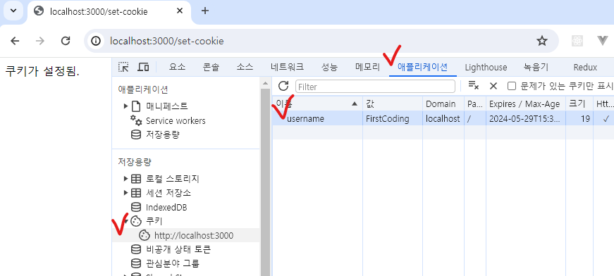

# 클라이언트 식별 (쿠키와 세션)
 - HTTP는 기본적으로 Stateless(무상태)이기 때문에 요청 간 이전의 상태를 알 수 없다. 
 - 따라서 로그인과 같은 기능을 구현하기 위해 접속자를 식별하기 위한 방법으로 쿠키와 세션을 활용하여 구현한다.

## 1. 쿠키 (Cookie)
 - 쿠키는 웹 브라우저에 저장되는 작은 데이터 파일로, 사용자와 웹사이트 간의 정보를 저장한다.
- **저장 위치:** 클라이언트(웹 브라우저).
- **만료 기한:** 쿠키는 설정된 만료 기한이 지나면 자동으로 삭제된다.
- **접근 범위:** 같은 도메인 내에서만 접근 가능.
- **보안:** 쿠키는 클라이언트 측에 저장되므로 보안에 취약할 수 있다. 중요한 정보는 저장하면 안됨.

### 사용 예
- **세션 관리:** 로그인 상태 유지 (세션 ID값을 쿠키로 기록하여 서버에서 식별)
- **사용자 설정 저장:** 언어, 테마 설정 등 (예: 오늘 창 열지 않기)
- **트래킹:** 사용자 행동 추적 (예: 검색어 기록)

### 쿠키 설정 HTTP 헤더
```
Set-Cookie: user_id=test; Expires=Wed, 21 Oct 2024 07:28:00 GMT; Secure; HttpOnly
```

## 2. 세션 (Session)
 - 세션은 서버 측에서 관리되는 저장 공간
 - 사용자와 웹 서버 간의 일시적인 정보를 유지하는데 활용.
 - **저장 위치:** 서버 측에 저장.
 - **식별자:** 각 세션은 고유한 세션 ID를 가지고 있으며, 이 ID는 클라이언트의 쿠키에 저장된다.
- **만료 기한:** 세션은 일정 기간 동안 활동이 없으면 자동으로 만료되며, 서버 설정에 따른다.
- **보안:** 세션 데이터는 서버 측에 저장되므로 쿠키보다는 상대적으로 보안이 높다.

### 사용 예
- **사용자 인증:** 로그인 정보 유지
- **장바구니:** 전자상거래 사이트에서의 쇼핑 카트 상태 유지

---

## Node.js에서 쿠키 사용
 - [cookie-parser](https://www.npmjs.com/package/cookie-parser) 미들웨어를 추가하여 구현한다.
 - 다음 코드로 node서버를 구동시킨 후 http://localhost:3000/set-cookie 접속 시 username쿠키가 설정된다.


```js
const express = require('express');
const cookieParser = require('cookie-parser'); // npm i cookie-parser

const app = express();
const port = 3000;

// cookie-parser 사용.
app.use(cookieParser());

// 쿠키 설정 예시
app.get('/set-cookie', (req, res) => {
  res.cookie('username', 'FirstCoding', { maxAge: 60000, httpOnly: true });
  res.send('쿠키가 설정됨.');
});

// 쿠키 읽기 예시
app.get('/get-cookie', (req, res) => {
  const username = req.cookies.username;
  if (username) {
    res.send(`저장된 쿠키: ${username}`);
  } else {
    res.send('설정된 쿠키 없음.');
  }
});

// 쿠키 삭제 예시
app.get('/clear-cookie', (req, res) => {
  res.clearCookie('username');
  res.send('쿠키 삭제 완료.');
});

app.listen(port, () => {
  console.log(`서버 실행 중: http://localhost:${port}`);
});

```

 - maxAge는 밀리초로 설정 (1분 후 쿠키가 만료된다.)
 - http://localhost:3000/get-cookie 접속 시 설정된 username 쿠키를 조회한다.
 - `httpOnly: true`는 자바스크립트에서 해당 쿠키의 접근을 제한한다. (보안상 악성 스크립트의 차단을 위해 true로 설정하는것이 좋음)
 - 브라우저의 개발자 도구에서 쿠키 상태를 확인해볼 수 있다.

    

---

## Node.js에서 세션 사용
- [express-session](https://www.npmjs.com/package/express-session)을 사용하여 다음과 같이 구현

```js
const express = require('express');
const session = require('express-session'); // npm i express-session

const app = express();
const port = 3000;

// express-session 설정
app.use(session({
  secret: 'your_secret_key', // 세션 암호화에 사용되는 키
  resave: false, // 세션이 수정되지 않아도 다시 저장할지 여부
  saveUninitialized: false, // 초기화되지 않은 세션을 저장할지 여부
  cookie: { maxAge: 60000 } // 쿠키의 유효 기간 설정 (밀리초 단위, 여기서는 1분)
}));

// 세션 설정 예시
app.get('/set-session', (req, res) => {
  req.session.username = 'FirstCoding';
  res.send('세션 설정됨');
});

// 세션 읽기 예시
app.get('/get-session', (req, res) => {
  const username = req.session.username;
  if (username) {
    res.send(`저장된 세션: ${username}`);
  } else {
    res.send('설정된 세션 없음');
  }
});

// 세션 삭제 예시
app.get('/clear-session', (req, res) => {
  req.session.destroy(err => {
    if (err) {
      return res.send('세션 삭제 오류.');
    }
    res.send('세션 삭제됨.');
  });
});

app.listen(port, () => {
  console.log(`서버 실행 중: http://localhost:${port}`);
});
```

## 실습과제
 - form에 id와 pw를 입력 받아 제출하는 형태의 간단한 로그인 메커니즘(로그인, 로그아웃)을 쿠키와 세션을 활용하여 각각 구현해보자.
